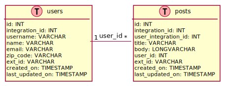

# Tarea corta #8 #

Curso IC-6821 Diseño de software  
Profesor Diego Munguía Molina

## Objetivos ##

* Implementar un diseño arquitectónico para integrar componentes locales con un sistema administrador de bases de datos.

## Guía de trabajo ##

Continuamos el desarrollo de nuestra aplicación de blogging.

La arquitectura del sistema se documenta en [ARCHITECTURE.md](./ARCHITECTURE.md) utilizando el modelo C4.

El sistema almacenará el contenido y los datos producidos por sus usuarios en una base de datos relacional; los datos
importados desde JsonPlaceholder también serán almacenados en el mismo repositorio.

### Tarea 1 ###

Implementar las entidades del sistema, incluyendo la lógica de integración con la base de datos. Con este fin 
utilizaremos el patrón de diseño *Data Access Object* (DAO). El DAO es un componente asociado con una entidad del modelo
relacional y ofrece métodos que permiten leer y escribir instancias de la entidad al repositorio de datos.

El siguiente diagrama presenta el diseño del modelo de datos

Ya hemos implementado el componente DAO para la entidad de usuarios `User`. Debemos entonces implementar el DAO 
correspondiente a `Post`, la entidad que modela los artículos del blog.

El DAO se implementará en el módulo `edu.tec.ic6821.blog.posts.model`.  

La clase `Post` es una estructura de datos que modela a la entidad definida en el modelo de datos. La clase mapea una 
propiedad por cada columna de la tabla correspondiente. Nótese la convención de nomenclatura utilizada en la tabla 
(snake_case) versus la utilizada en la clase (camelCase).

Todas las entidades contienen propiedades para almacenar los siguientes metadatos:
* `id` Llave primaria auto incremental.
* `extId` Llave externa modelada como un UUID, la intención es utilizarla para identificar el registro fuera de las 
  fronteras del sistema.
* `createdOn` Fecha y hora en que se insertó el registro.
* `lastUpdatedOn` Fecha y hora de la última vez que se actualizó este registro.

La interfaz `PostDao` modela el contrato para el DAO, el cual ofrecerá los siguientes métodos para insertar y consultar 
datos:

* `create(:Post): Post` Inserta un nuevo registro a la base de datos, retorna el objeto insertado. Recibe una instancia 
  de `Post` sin metadatos, retorna una instancia de `Post` con metadatos.
* `create(:List<Post>): int` Inserta una serie de nuevos registros a la base datos, retorna la cantidad de objetos 
  insertados. Recibe una lista de instancias de `Post` sin metadatos, retorna el número de registros insertados. En una
  situación ideal el número de registros insertados debe ser igual al tamaño de la lista enviada de parámetro, si es 
  menor indica que la base de datos falló en insertar uno o más registros.
* `findById(:Long): Optional<Post>` Consulta para traer un registro por llave primaria. Recibe la llave primaria a 
  buscar, retorna un `Optional` que contiene al `Post` si encuentra el registro identificado por la llave en la base de
  datos, o vacío en cualquier otro caso.
* `findByExtId(:String): Optional<Post>` Consulta para traer un registro por llave externa. Recibe la llave a
  buscar, retorna un `Optional` que contiene al `Post` si encuentra el registro identificado por la llave en la base de
  datos, o vacío en cualquier otro caso.
* `getAll(): List<Post>` Consulta para traer todos los registros almacenados en la base de datos.
* `findByUserId(:Long): List<Post>` Consulta para traer todos los registros asociados con un usuario específico. Recibe 
  el identificador del usuario, retorna la lista de todos los artículos asociados al usuario. Si no hay registros 
  asociados, retorna una lista vacía.

La clase `HSQLDBPostDao` es una implementación del contrato `PostDao` específica para integrarse con un sistema de bases 
de datos [HyperSQL DB](http://hsqldb.org).

La clase `PostRowMapper` permite mapear filas de un `ResultSet` de JDBC a instancias de `Post`.

Debe implementar las clases:

* `HSQLDBPostDao`
* `PostRowMapper`

El repositorio GIT ya contiene una implementación semejante para las entidades de usuarios en el paquete 
`edu.tec.ic6821.blog.users.model`. Se recomienda utilizar este código como referencia.

## Aspectos operativos ##

- No modificar ningún archivo de código ya existente en el repositorio.
- No modificar ninguna prueba automatizada.
- No modificar ningún chequeo de estilo. 
- No utilizar spanglish.
- Escribir código limpio.
- Las pruebas de código verifican todos los requerimientos funcionales.
- Como entrega se considera el último `push` de código al repositorio antes de la revisión del trabajo.
- Puede encontrar información sobre cómo corregir problemas identificados por los chequeos de estilo en el siguiente 
  enlace: https://checkstyle.sourceforge.io/checks.html 

## Rúbrica ##

#### Total 10 pts #### 

#### Entrega (2 pts) ####
- (2 pts) El historial del repositorio contiene commits significativos de la persona estudiante.
- (0 pts) El historial del repositorio no contiene commits significativos de la persona estudiante. Si no hay commits 
  significativos, el resto de criterios no serán aplicados.

#### Chequeo de estilo (2 pts) ####
- (2 pts) El código en el repositorio pasa todos los chequeos de estilo.
- (0 pts) El código en el repositorio no pasa todos los chequeos de estilo.

#### Chequeo de diseño (3 pts) ####
- (3 pts) El código en el repositorio pasa todos los chequeos de diseño.
- (1 pts) El código en el repositorio pasa la mayoría de los chequeos de diseño.
- (0 pts) El código en el repositorio no pasa los chequeos de diseño.

#### Pruebas de código (3 pts)
- (3 pts) El código en el repositorio pasa todas las pruebas de código.
- (1 pts) El código en el repositorio pasa la mayoría de las pruebas de código.
- (0 pts) El código en el repositorio no pasa las pruebas de código.

